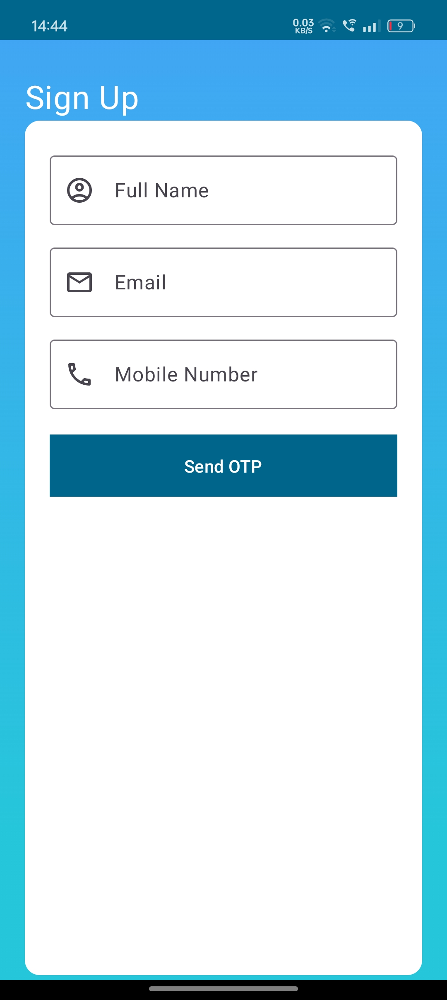
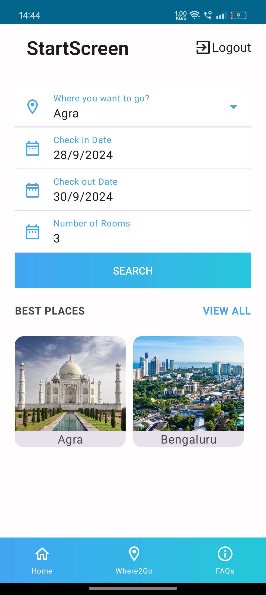
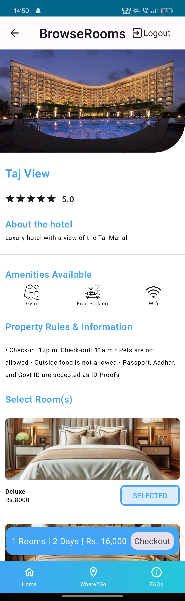
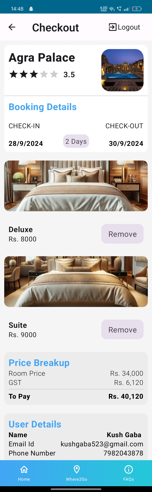

# Hotel-Nest

## **Project Description**
Hotel Nest is a hotel management application built using Android Studio. It allows users to search for hotels based on city, check-in and check-out dates, and the number of rooms. The app uses Firebase Authentication for OTP-based login and Firebase Realtime Database for data storage and retrieval.

## **Features**
**OTP-Based Authentication:** Secure user login using Firebase Authentication.  
**Search Functionality:** Users can enter a city, check-in and check-out dates, and the number of rooms to find available hotels.  
**Hotel Listing:** Displays a list of hotels fetched from the Firebase Realtime Database based on the user's search criteria.  
**Checkout Screen:** Shows selected rooms, total bill calculation based on room selections and the number of days between check-in and check-out, along with user details (name, phone, email) entered during authentication.  
**Browse Cities:** Users can explore different cities and view their details.  
**Realtime Contact with Database** All of the data entered by users is sent to realtime database. And all of the required data is feteched from there only.

## **Architecture**
The app implements the MVVM (Model-View-ViewModel) architecture for better separation of concerns and improved testability.

## **Installation and Setup**
**Clone the repository:**  
Open your terminal and run the following command:  
git clone https://github.com/Kushgaba/Hotel-Nest.git

**Open the project in Android Studio:**  
**(1)** Launch Android Studio.  
**(2)** Click on File > Open... and navigate to the cloned repository folder (Hotel-Nest), then click OK.  
**(3)** Make sure you have all the dependencies and the required SDK.  

**Build and run the project.**  
**(1)** Connect your Android device or start an emulator.  
**(2)** Click on the Run button (green play icon) in Android Studio to build and launch the app on your device/emulator.

## **Technologies Used**
Android Studio  
Firebase (Authentication and Realtime Database)  
Kotlin   
Jetpack Compose  

## **Purpose**  
This project was created for practice and to demonstrate my skills in Android development, particularly in using Firebase for backend services.

## **Contact**
Author: Kush Gaba
Email: kushgaba523@gmail.com

## **Relevant Screenshots**

<table style="border-collapse: collapse; width: 100%;">
  <tr>
    <td style="border: none; text-align: center;">
      
    </td>
    <td style="border: none; text-align: center;">
      
    </td>
  </tr>
  <tr>
    <td style="border: none; text-align: center; width: 50%;">
      
    </td>
    <td style="border: none; text-align: center; width: 50%;">
      
    </td>
  </tr>
</table>

  

